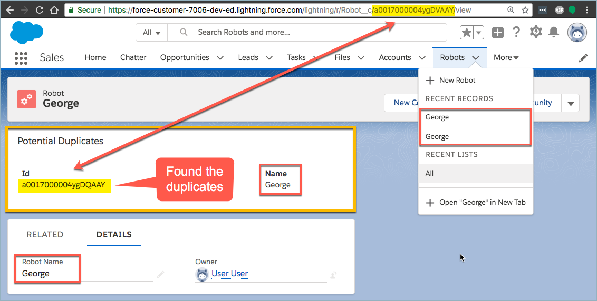

Potential Duplicates Component
==============================

Work in progress.

Inspired by [David Giller](https://twitter.com/davidgiller/status/1026934520560283648?s=11),
who was looking for a way to use the standard [Potential Duplicates component](https://help.salesforce.com/articleView?id=duplicates_existing_setup.htm&type=5) 
on a Lightning record page for custom objects.

The standard component only supports Accounts, Contacts, and Leads.

This project introduces a custom component that supports all objects.

Related Ideas
-------------

* [Potential Duplicates for Custom Objects](https://success.salesforce.com/ideaView?id=0873A000000CSx5QAG)
* [Is the Potential Duplicate Standard Component also for Custom Objects on the roadmap?](https://salesforce.stackexchange.com/questions/196169/is-the-potential-duplicate-standard-component-also-for-custom-objects-on-the-roa)

Credits
-------

Doug Ayers, develops and maintains this project.

Ruslan Kurchenko, for the [LAX](https://github.com/ruslan-kurchenko/sfdc-lax) library.